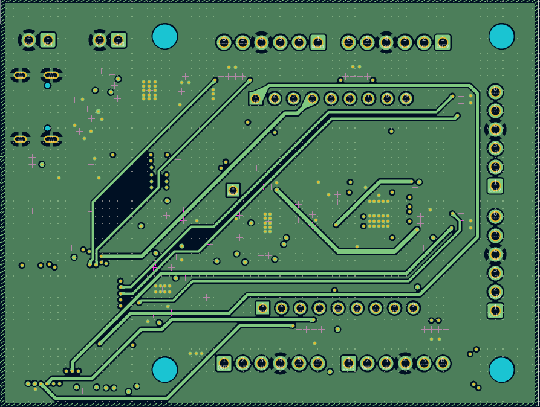
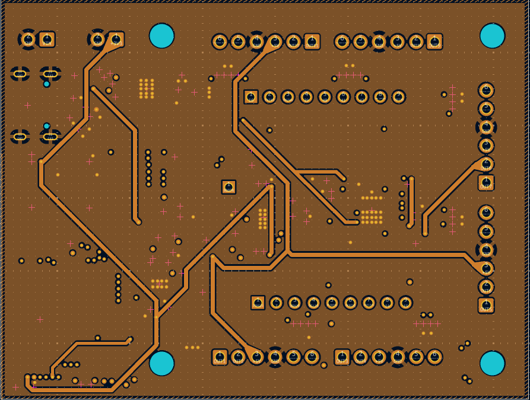
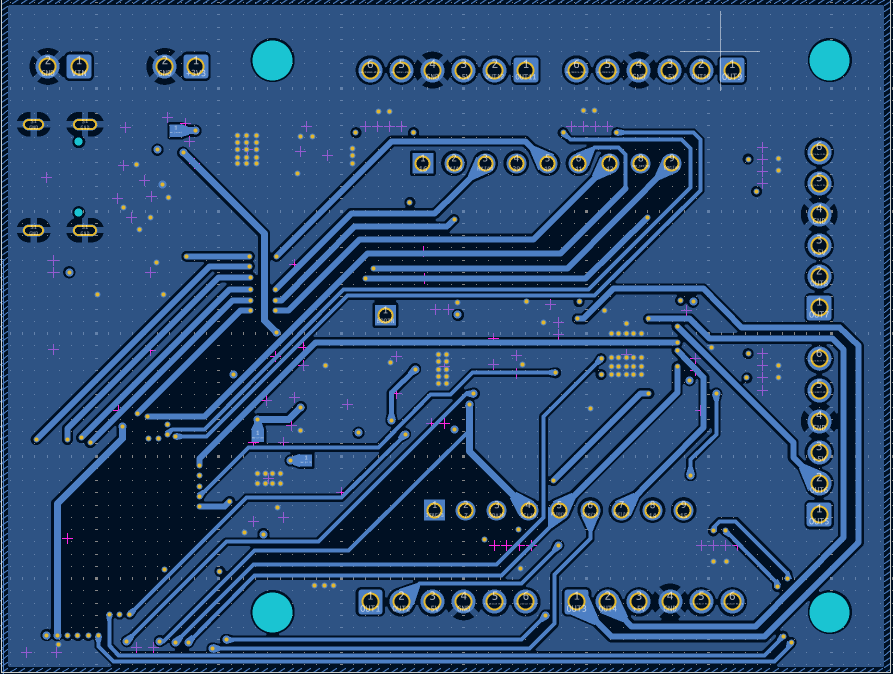

## 26th June 2025: Minor Improvements

Today I added X-Y axes for the IMU to the PCB's silkscreen alongside adding some more thermal vias. 
I also fully completed the BOM.

**Total time spent: 1.5h**

## 24th June 2025: Started Working on Library

I started working on the Arduino library for the board today. It is/will be a wrapper around other libraries that are used to control the BNO086 and DRV8912-Q1. 
Today I created functions in the library for easily getting data from the IMU and printing it alongside an example Arduino sketch. 
I am using the [SparkFun BNO08x Cortex Based IMU Library](https://github.com/sparkfun/SparkFun_BNO08x_Arduino_Library) for the BNO086 and will creating my own library for the DRV8912-Q1.

**Total time spent: 4h**

## 23rd June 2025: Created BOM

Today I created the almost final BOM for the board containing all the components used on the board.

**Total time spent: 3h**

## 21st to 22nd June 2025: Completed PCB

I spent these 2 days completing the PCB layout and routing all the tracks. The routing got pretty hard with the last 10 to 15 tracks and I had to use both of the inner layers to successfully route the PCB.

|  |  |  |  |
| :------------------------------------: | :------------------------------------: | :------------------------------------: | :------------------------------------: |
|                Layer 1                 |                Layer 2                 |                Layer 3                 |                Layer 4                 |

**Total time spent: 8h**

## 20th June 2025: Made Fixes to the Schematic

I did a final review of the schematic today and did the needed fixes alongside adding test points and LEDs. I also routed some of the PCB today.

**Total time spent: 5h**

## 19th June 2025: Completed Placement of Connector Components

Today I first placed the ESP32-S3 on the bottom right of the PCB similar to the recommendation in the application information. Then I placed the various types of connectors symetrically on the board, alongside positioning the screw holes.

**Total time spent: 2h**

## 18th June 2025: Created a Diagram Showing ROS 2 Usage

Today I created a diagram showing how the board will be used with ROS 2, this will be useful to create the ROS 2 code to be used with this board.
I also made some fixes to the schematic.

|  |
| :-----------------------------------------------------: |
|                   ROS 2 Usage Diagram                   |

**Total time spent: 1.5h**

## 17th June 2025: Created Board Schematic

Today I created the full schematic for the board.
I settled on the following ICs: ESP32-S3, BNO086(IMU), DRV8912-Q1(Motor Driver), LMR38020FDDAR(5V Regulator), TPS2116DRLR(Power Mux for selecting between 5V from regulator and USB), LD39200PU33R(3.3V Regulator).

|  |
| :--------------------------------------: |
|                Schematic                 |

**Total time spent: 6h**
