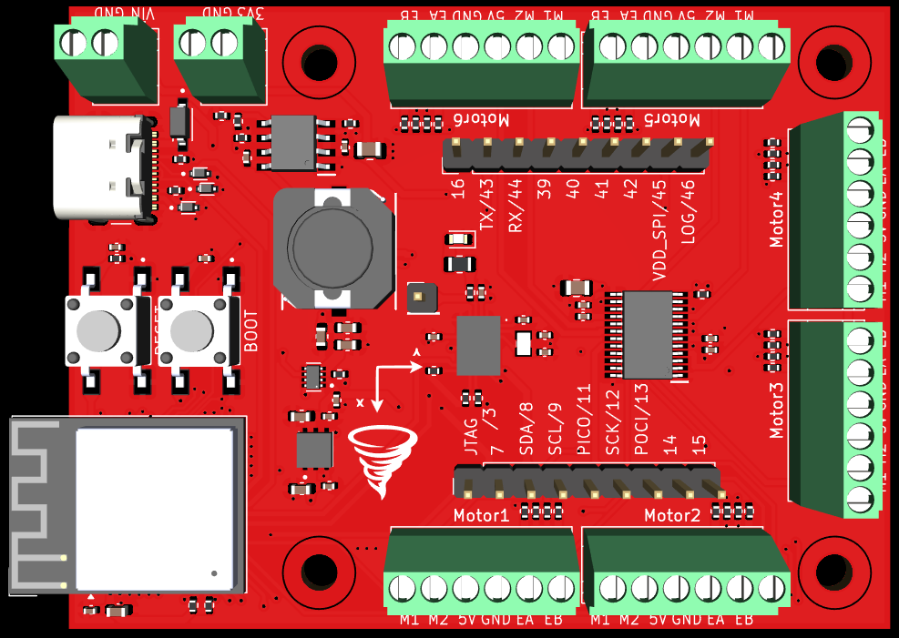

# ESP32-S3 6 Motor Driver with IMU

**_This board is currently in development._**

This board features an **ESP32-S3** microcontroller, a **6-channel** DC **motor driver**, and an integrated **BNO086 IMU** for precise motion and orientation data. 
It supports **encoder feedback**, enabling accurate position control. Motors can be driven at voltages up to **36V**.

This board is perfect for robots requiring more than two motors. 
Simply wire your motors, connect the board to a PC, another microcontroller, or even your phone/tablet and use the ESP32-S3's versatile communication options like I2C, SPI, UART, Wi-Fi, and Bluetooth to control your robot.

A full **Arduino library** for the board is available that allows you to control the motors, IMU, and read data from the encoders. 
Sample **ROS 2** packages are also available, that show the recommended usage of the board with ROS 2.

## 📂 About this Repository

This repository contains all code, design files, and information related to the ESP32-S3 6 Motor Driver with IMU.

### Directory Information

- [assets/](assets/): Assets used throughout this repository.
- [hardware_design/](hardware_design/): Complete KiCad project design files, schematic, 3D model, and BOM.

### Related Repositories

- [ESP32-S3_6_Motor_Driver_IMU_Library](https://github.com/amronos/ESP32-S3_6_Motor_Driver_IMU_Library/): Arduino library for the board.
